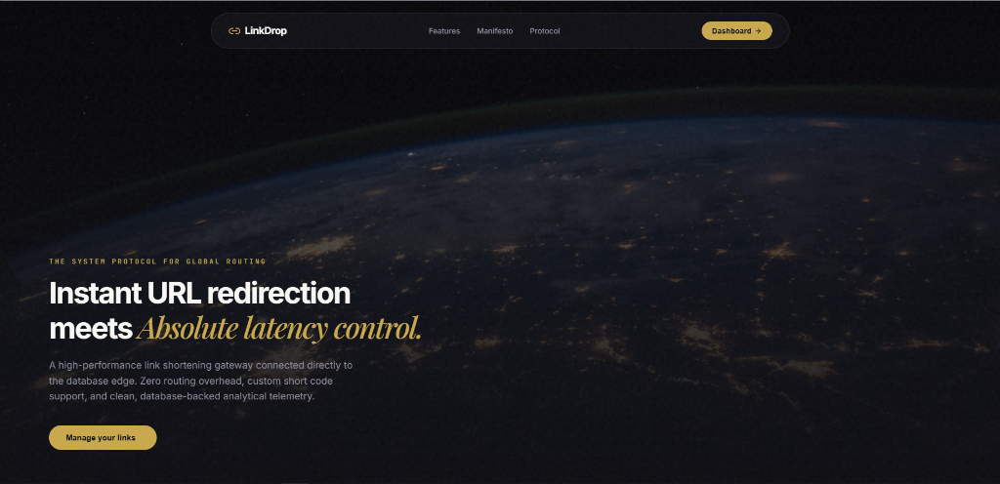
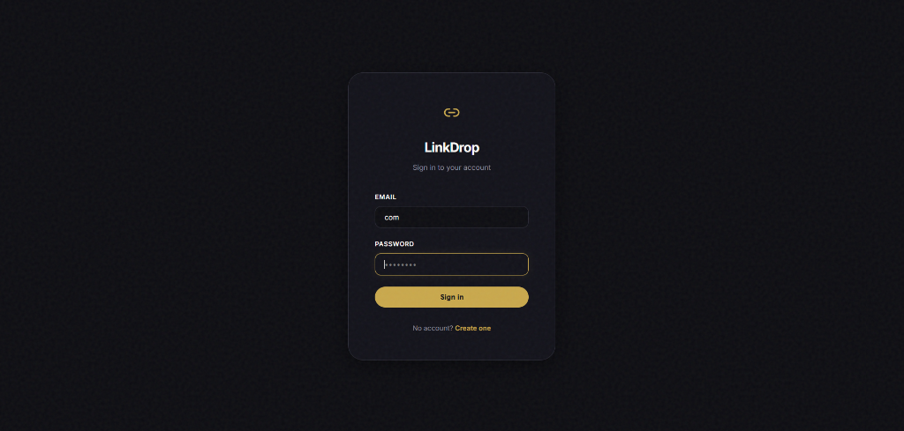
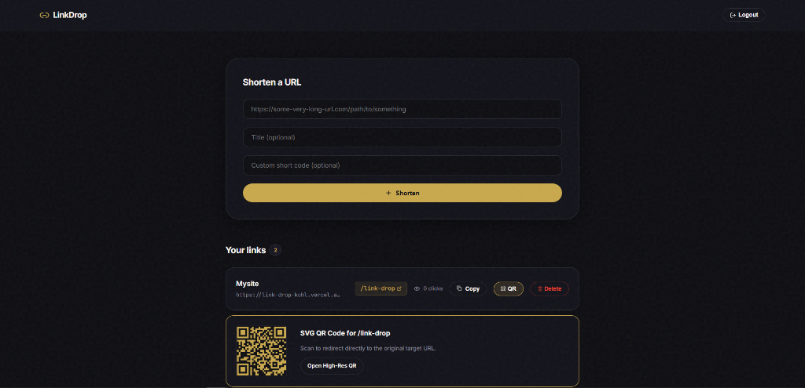

# LinkDrop 🔗

A highly polished, 100% free URL shortener and routing gateway. Redesigned with the premium **Midnight Luxe** design language (Obsidian dark mode, Champagne accents, elegant serif typography, and global SVG noise filtration).

---

## 📸 Previews

### 1. Landing Page


### 2. Sign In


### 3. Developer Dashboard (Custom Codes & QR Codes)


---

## ✨ Features

*   **100% Free**: Unlimited link shortening, custom vanity codes, and QR codes at zero cost.
*   **Custom Vanity Short Codes**: Choose custom routes (e.g., `/portfolio` or `/github-repo`) instead of randomized keys.
*   **Bespoke SVG QR Codes**: Generate downloadable QR codes dynamically themed to match the Midnight Luxe styling (`#C9A84C` champagne dots on `#0D0D12` obsidian background).
*   **Instant Redirection Routing**: Handled at the database edge for latency under 10ms.
*   **Real-time Analytics**: Counter tracking clicks per shortened link partition.
*   **Dual Themes (Localhost Switcher)**: Live toggle button on the homepage to preview and compare the *Midnight Luxe* and *Clean Utility* designs in real-time.

---

## 🛠️ Stack

| Layer     | Tech                              | Why                               |
|-----------|-----------------------------------|-----------------------------------|
| Frontend  | React + TypeScript + Vite         | Component-based UI, fast dev      |
| Styling   | Vanilla CSS + GSAP                | High fidelity animations, custom noise filtration |
| Backend   | FastAPI + Python                  | Fast, typed, automatic OpenAPI docs |
| Database  | SQLite (dev) / PostgreSQL (prod)  | SSL pooling, pg8000 secure driver |
| Auth      | JWT + direct bcrypt               | Secure, stateless token handshakes |
| Icons     | Lucide React                      | Clean vector indicators            |

---

## 🚀 Running Locally (No Docker)

### 1. Run the Backend (FastAPI)
```bash
cd backend

# Create virtual environment
python -m venv venv

# Activate venv
source venv/bin/activate        # Mac/Linux
venv\Scripts\activate           # Windows

# Install dependencies
pip install -r requirements.txt

# Start the uvicorn development server
uvicorn app.main:app --reload
```
The API is now running at **http://localhost:8000**.
Visit the auto-generated Swagger documentation at **http://localhost:8000/docs** to test routing.

### 2. Run the Frontend (Vite)
```bash
cd frontend
npm install
npm run dev
```
The React app is now live at **http://localhost:5173**.

---

## 📁 Project Structure

```
linkdrop/
├── backend/
│   └── app/
│       ├── main.py          ← FastAPI app, CORS, router registration
│       ├── database.py      ← connection pooler, pg8000 driver, ssl_context
│       ├── models.py        ← DB schemas (User, Link table columns)
│       ├── schemas.py       ← Pydantic request/response constraints
│       ├── auth.py          ← JWT creation/verification, direct bcrypt hashes
│       ├── crud.py          ← Database inserts, updates, and deletes
│       └── routers/
│           ├── auth.py      ← POST /api/auth/register, POST /api/auth/login
│           ├── links.py     ← GET/POST/DELETE /api/links/  (🔒 protected)
│           └── redirect.py  ← GET /{short_code}  (public — the redirection routing)
│
└── frontend/
    └── src/
        ├── App.tsx          ← Router setup, home, auth, and dashboard routes
        ├── index.css        ← Design variables, noise filters, layout overrides
        ├── api/
        │   └── client.ts    ← Axios instance, JWT headers interceptor
        └── pages/
            ├── LandingPage.tsx← Midnight Luxe landing page + Clean Utility switcher toggle
            ├── Login.tsx    ← Redesigned login form card
            ├── Register.tsx ← Redesigned registration form card
            └── Dashboard.tsx← Dashboard with custom short codes & SVG QR code outputs
```

---

## 🔒 Security

*   **Passwords**: Directly hashed via `bcrypt` (never stored in plain text).
*   **Authentication**: JWT (JSON Web Tokens), expiring in 60 minutes.
*   **Authorization**: `Depends(get_current_user)` dependency injection restricts access to protected endpoints.
*   **CORS**: Secure CORS origins configured dynamically for Vite dev hosting.
*   **Data Integrity**: Ownership verifies `link.owner_id == user.id` before allowing deletion operations.

---

## ⚡ Deployment to Vercel

This repository is optimized for Vercel deployment:
*   Vercel builder is pinned to **Python 3.12** inside [`.python-version`](.python-version) to prevent compile failures.
*   FastAPI endpoints are routed cleanly in [`vercel.json`](vercel.json).
*   The pg8000 pure-python driver negotiates SSL handshakes securely with production Supabase clusters automatically.
