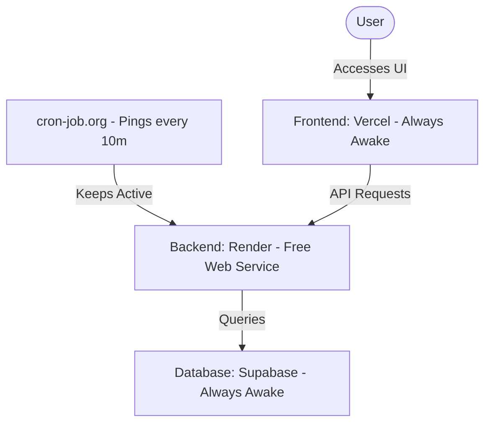

# Step-by-Step Free Cloud Deployment Guide 🚀

This guide explains how to deploy LinkDrop completely for free with services that stay online 24/7 (without sleeping).

---

## The Zero-Sleep Free Stack (Vercel + Render + Supabase + cron-job.org)

This deployment model keeps your web services online 24/7 without sleeping. We use `cron-job.org` to send a lightweight ping to the Render backend every 10 minutes to prevent the container from scaling down.

---

### Step 1: Create a Free PostgreSQL Database on Supabase
1. Go to [supabase.com](https://supabase.com) and sign up/log in.
2. Click **New Project** and select your organization.
3. Fill in the project details:
   - **Name**: `linkdrop-db`
   - **Database Password**: *Save this password somewhere safe!*
4. Click **Create new project**.
5. Once provisioned, go to **Project Settings** (gear icon) -> **Database**.
6. Under **Connection string**, select **URI**. Copy the connection string and replace `[YOUR-PASSWORD]` with the password you chose.

---

### Step 2: Deploy the Backend on Render
1. Go to [render.com](https://render.com) and sign up with your GitHub account.
2. Click **New +** in the dashboard and select **Web Service**.
3. Select **Connect a repository** and choose your LinkDrop repository.
4. Fill in the service configuration:
   - **Name**: `linkdrop-api`
   - **Region**: Choose a region near your database region (e.g., `Oregon (US West)` or `Ohio (US East)`).
   - **Branch**: `main`
   - **Root Directory**: `backend`
   - **Runtime**: `Docker` (it will auto-detect the `Dockerfile` inside `/backend`).
   - **Instance Type**: `Free`
5. Click **Advanced** -> **Add Environment Variable**:
   - **DATABASE_URL**: *Paste your Supabase URI from Step 1.*
   - **SECRET_KEY**: *A long secure random string.*
6. Click **Create Web Service**.
7. Once built and healthy, copy the public URL (e.g. `https://linkdrop-api.onrender.com`).

---

### Step 3: Set up the Uptime Pinger on cron-job.org
To keep the Render free tier from going to sleep, we configure an external pinger:
1. Go to [cron-job.org](https://cron-job.org/) and create a free account.
2. Go to the dashboard and click **Create Cronjob**.
3. Configuration:
   - **Title**: `Keep LinkDrop Active`
   - **URL**: Paste your Render API health URL: `https://YOUR-RENDER-URL.onrender.com/api/health`
   - **Execution Schedule**: Select **Every 10 minutes**.
4. Click **Create**. This sends a request to your API every 10 minutes, keeping the backend container awake.

---

### Step 4: Deploy the Frontend on Vercel
1. Go to [vercel.com](https://vercel.com) and sign up.
2. Import your GitHub repository.
3. Configure the project:
   - **Framework Preset**: `Vite`
   - **Root Directory**: Select `frontend`
4. Expand **Environment Variables** and add:
   - **Name**: `VITE_API_URL`
   - **Value**: *Paste your Render backend URL from Step 2.*
5. Click **Deploy**.
